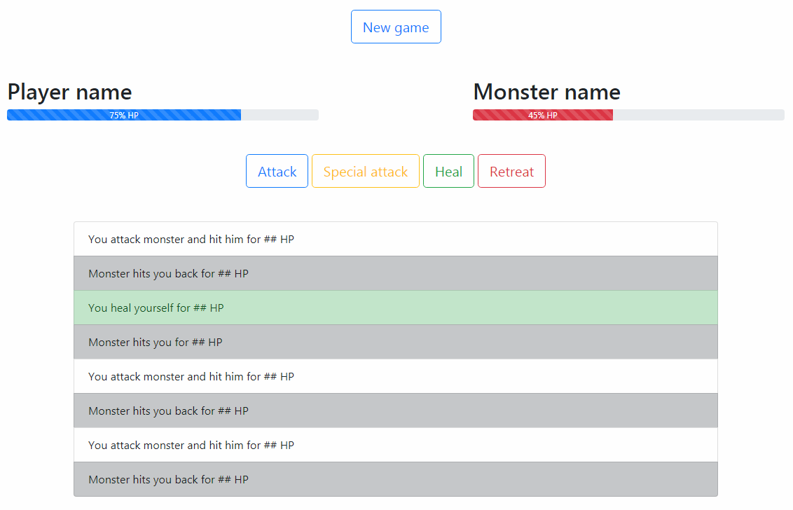

# Проект 1: Охотник на монстров

> Начальные файлы находятся в этой папке.

## Интерфейс игры разделен на 4 части:
1. Начало новой игры
1. Статус здоровья у игрока и у монстра
1. Действия игрока
1. История битвы

## Задача
Пока игра не началась, игроку видна только кнопка "New game" (Все другие блоки спрятаны). После нажатия на кнопку "New game" появляется блок со статусом здоровья игрока и монстра, действия игрока, сам блок с кнопкой "New game" прячется.

При действиях игрока информация о статусе битвы добавляется в блок "История битвы". (После каждого действия игрока, будь то атака\специальная атака\лечение - монстр наносит ответный удар). 

Относительно оставшегося количества здоровья - изменяется полоска здоровья (Health bar)

Проигрывает тот, чья жизнь быстрее упадет до 0. При победе игрока или монстра - выводиться сообщение (через обычный alert) о том, кто победил.

При нажатии на кнопку "Retreat" автоматически побеждает монстр, о чем выводиться сообщение (можно через обычный alert) и игра возвращается в своё изначальное состояние (где спрятан интерфейс и показана только кнопка "New game").

> При необходимости или возможности - разбить игру игру на компоненты.

### Действия игрока
* Attack - наносит удар монстру, который равен случайному числу от 1 до 10.
* Special Attack - наносит более сильную атаку по монстру, которая равна величине обычной атаки, умноженный на модификатор (может быть случайным от 1 до 2)
* Heal - лечит игрока на случайное число от 1 до 10
* Retreat - при нажатии на кнопку игрок автоматически "проигрывает" битву.

### Действия монстра
При каждом действии игрока (будь то лечение (Heal) либо какая-то из атак (Attack\Special attack)) - монстр наносит ответный удар, который равен случайному числу от 5 до 15 (Либо измените это значение на более удобное, но урон от монстра должен быть существенным, чтобы был какой-то азарт :) )

### История битвы
При нанесении атаки, лечения, получения урона от монстра - информация отображается в истории битвы.
  Для элементов списка можно использовать следующие классы:
>**.list-group-item-dark** - При атаке монстра
 **.list-group-item-success** - При лечении

## Дополнительные варианты улучшения игры
* В зависимости от уровня здоровья игрока или монстра - изменять цвет полоски здоровья. Для этого можно использовать следующую схему: 

>**100% - 80%** использовать класс .bg-success
 **79% - 50%** использовать класс .bg-info
 **49% - 25%** использовать класс .bg-warning
 **1% - 24%** использовать класс .bg-danger
* Добавить возможность для игрока - выбирать себе имя и сохранять его для будущего использования;
* Добавить монстру возможность использовать специальную атаку;
* Добавить в систему боя "Критическую атаку", которая может быть применена как к монстру так и к игроку;
* Добавить кнопку с возможность вести "Автобой";
* Добавить в систему боя возможность нанести нулевой урон. В таком случае в истории добавляется запись о том, что игрок или монстр уклонился от удара;
* Добавить в систему боя возможность полечится для монстра;
* Добавить возможность "Сохранить результаты" и "Просмотреть их";
* Добавить в игру несколько видов монстров с возможностью выбора их для битвы или случайного появления;
* Изменить боевую систему методом введения в неё таких понятий как "Критическая атака", "Контр-удар", "Оглушение" с шансовыми значениями.
* Добавить в игру несколько специализаций для героя с возможностью их выбора. Для этого можно использовать пример:
> **Рыцарь** - у даного персонажа достаточно большое количество здоровья, но малая атака. При критической атаке по нему - есть возможность "уклонится" от неё;
 **Ассасин** - у даного персонажа малое количество здоровья, но большая атака, больший шанс нанести критическую атаку по противнику, больший шанс для уклонения от простых атак;
 **Паладин** - обычный игрок.
* Добавить мультиязычность;
* Ввести систему предметов и золота и опыта;
* Ввести систему характеристик героя и их влияние на бой.
* Экспериментировать, добавить что-то своё и так далее.